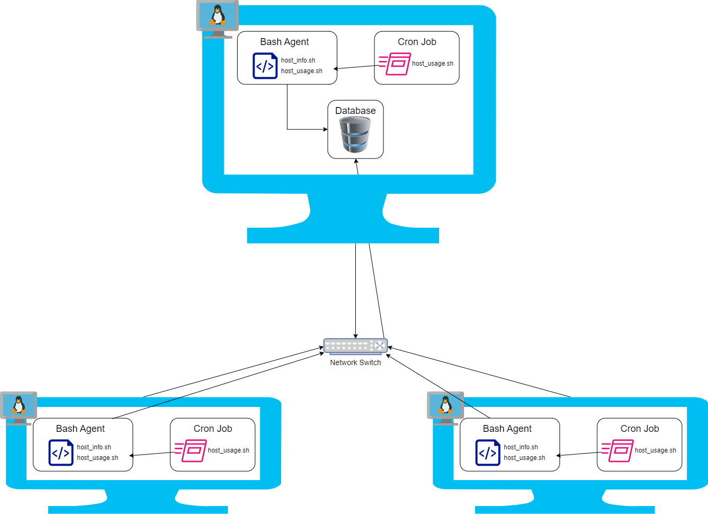

# Linux Cluster Monitoring Agent

# Introduction
The Linux Cluster Monitoring Agent is a Minimum Viable Product (MVP) that
is used to record hardware specifications and monitor resource usages 
for each node in real time to help the Jarvis Linux Cluster Administration
(LCA) team manage their Linux cluster environment. The product is built 
using Linux bash scripts to collect the data, PostgreSQL to store the data, 
docker for hosting the database, and Git for version control.

# Quick Start
### Start a PSQL Instance using `psql_docker.sh`
Create a docker if you don't have one:
```
./scripts/psql_docker.sh create postgres password
```

Start or stop the Docker Container:
```
./scripts/psql_docker.sh start | stop
```

Connect to PSQL Instance:
```
psql -h localhost -U postgres -W
```
The password is: password

### 2. Create the Tables Using `ddl.sql`

First, connect to the PSQL Instance and create the database:
```
CREATE DATABASE host_agent;
```

Create and verify the tables:
```
psql -h localhost -U postgres -d host_agent -f sql/ddl.sql
```

### 3. Insert hardware information  database
Insert hardware specs using `host_info.sh` 

```
./scripts/host_info.sh localhost 5432 host_agent postgres password
```

Insert hardware usage using `host_usage.sh`
```
./scripts/host_usage.sh localhost 5432 host_agent postgres password
```

Verify if the data has been entered (will not create a new table as it
already exists): 
```
psql -h localhost -U postgres -d host_agent -f sql/ddl.sql
```

### 4. Setup Crontab to periodically populate the database with hardware usage data
Make sure you are in the scripts directory. Copy the path once you are in there:
```
pwd
```

Open up crontab jobs:
```
crontab -e
```

Edit the crontab job using the path you obtained:
```
* * * * * bash [path]/host_usage.sh localhost 5432 host_agent postgres password > /tmp/host_usage.log
```

If you want to stop the crontab job, just remove the job from the 
crontab file

# Implementation
- The Linux Cluster Monitoring Agent was created by containerizing a 
PostgreSQL instance using a docker
- A docker volume was used to persist the PostgreSQL data outside
the lifecycle of the docker container allowing you to share the same
data between multiple containers
- The `ddl.sql` script was created to automate the creation of the tables
- The `host_info.sh` and `host_usage.sh` scripts were created to find and
insert hardware data of the machine onto the database
- A crontab job was created to automate the `host_usage.sh` script by
periodically running it every minute

## Architecture


## Scripts
### psql_docker.sh
The `psql_docker.sh` script is used to setup a PostgreSQL instance using docker that can be used on a 
local machine

Create a container if it does not exist:
```
./scripts/psql_docker.sh create [username] [password]
```

Start or stop the container
```
./scripts/psql_docker.sh [start | stop]
```

### ddl.sql
The `ddl.sql` script is used to automate the database initialization 
to eliminate the manual process

Execute the script on the database:
```
psql -h localhost -U postgres -d host_agent -f sql/ddl.sql
```
### host_info.sh
The `host_info.sh` script is used to collect hardware specs and 
persist the data into a PostgreSQL instance. This data was only collected
once.

Insert hardware info into the table:
```
./scripts/host_info.sh psql_host psql_port db_name psql_user 
```

### host_usage.sh
The `host_usage.sh` script is used to collect hardware usage and 
persist the data into a PostgreSQL instance. This process was automated 
using Cronjob.

Insert hardware usage into the table:
```
./scripts/host_usage.sh psql_host psql_port db_name psql_user psql_password
```

### Crontab
Crontab allows you to schedule commands to be executed periodically at 
a fixed interval. It was used to run the `host_usage.sh` script every 
minute

Create Cron Job:
```
* * * * * bash [path to scripts]/host_usage.sh localhost 5432 host_agent postgres password > /tmp/host_usage.log
```

## Database Modeling
### Table: `host_info`
| Column Name      | Data Type | Constraints      |
|------------------|-----------|------------------|
| id               | SERIAL    | PRIMARY KEY      |
| hostname         | VARCHAR   | NOT NULL, UNIQUE |
| cpu_number       | INT2      | NOT NULL         |
| cpu_architecture | VARCHAR   | NOT NULL         |
| cpu_model        | VARCHAR   | NOT NULL         |
| cpu_mhz          | FLOAT8    | NOT NULL         |
| l2_cache         | INT4      | NOT NULL         |
| "timestamp"      | TIMESTAMP | NULL             |
| total_mem        | INT4      | NULL             |

### Table: `host_usage`
| Column Name      | Data Type | Constraints |
|------------------|-----------|-------------|
| "timestamp"      | TIMESTAMP | NOT NULL    |
| host_id          | SERIAL    | FOREIGN KEY |
| memory_free      | INT4      | NOT NULL    |
| cpu_idle         | INT2      | NOT NULL    |
| cpu_kernel       | INT2      | NOT NULL    |
| disk_io          | INT4      | NOT NULL    |
| disk_available   | INT4      | NOT NULL    |

# Test
Bash scripts were tested by using the `bash -x [filename].sh` command. This
command prints each line, the arguments, and logical operations. It helps
you test your script, so you can avoid or catch bugs.

The Data Definition Language (DDL) was tested using a Data Query 
Language (DQL) SELECT and a DML (Data Definition Language) INSERT. 
- `SELECT * FROM host_info` was used to verify if the table was created by
seeing if the columns were accurately created and if they all existed
- `INSERT INTO host_info ([columns]) VALUES ([values])` was used to verify
if the table was created with the correct data types. For example, cpu_mhz
should be float8 and not int4

# Deployment
The app was deployed using Github, Docker, and Crontab
- Git was used for local version control
- Github was used to host the Git's repo online 
- Docker was used for hosting the PostgreSQL database
- Crontab was used to periodically execute bash scripts

# Improvements
- An alert mechanism to warn the user based on a threshold they set for 
free memory
- Create a graph that contains all the node's information so you can 
compare machine data like memory, idle time, and disk availability
- Create scripts for queries that would provide useful information like
average idle time and average disk usage
