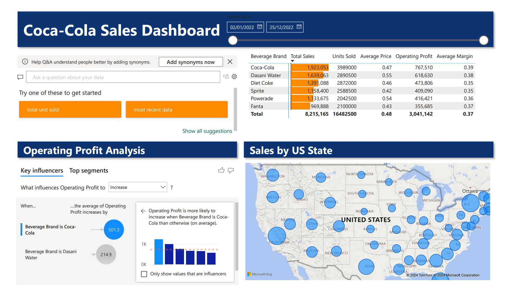
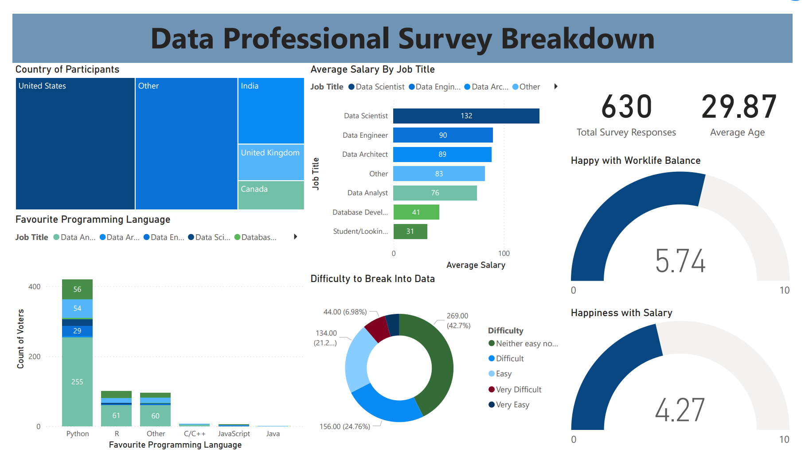
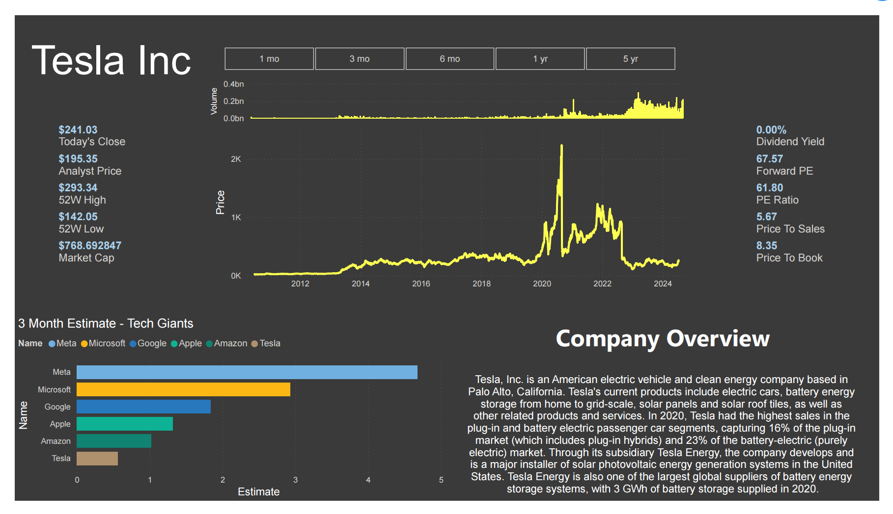

# Beverages Dashboard

Beverage Dashboard provides an overview of the performance of various beverage companies in the United States.
This dashboard covers key brands like Coca-Cola, Sprite, Fanta, Powerade, and others. Key features are total
sales, units sold, average price, sales by state, and profit analysis.

The dashboard is an essential tool for stakeholders to monitor and evaluate the performance of beverage companies
to make informed business decisions and identify opportunities for growth and improvement.

### Potential Improvements
- Better data on profit analysis as the variable for determining operating profit is brand recognition. Data such
as how  many ads are run in each state and how many celebrities promote the product could be more useful
- Using a model to predict future sales based off current data

# Data Professionals Survey Report

Data Professionals Survey Dashboard provides an analysis of survey responses from data professionals offering
insights into their roles and experiences in their industry. Key features are average salary, happiness with 
salary, work-life balance rating, favourite programming language, and opinion on difficulty of breaking into the
field. 

The dashboard allows professionals and students interested in getting a data job to understand the current state
of the industry. 

### Potential Improvements
- Have a year-year comparison to show how the responses have changed over the years
- Career progression paths, how many people shifted from another job occupation or people who studied for this
from the beginning

# Stocks Dashboard

Stocks Dashboard provides a visualization a specific stock's statisctics offering investers and analyssts a detailed
view of it's performance in the market and financial metrics. Some of the features are closing price, 52 weeks 
high and low, market cap, 3 month estimates on the tech giants like Meta, Microsoft, Google, Apple, and Amazon. 

The dashboard also shows an overview of the current company's stock you are interested in as well as thei closing
price since the stock's existence. It can also be filtered for 1 month, 3 month, 6 month, 1 year, and 5 year
analysis.

### Potential Improvements
- Dropdown option to change ticker instead of changing a variable
- News article information for the stock